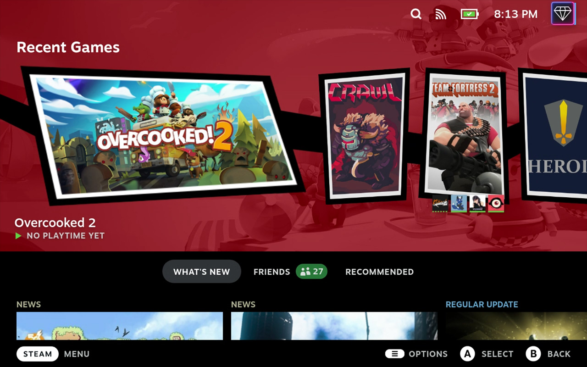
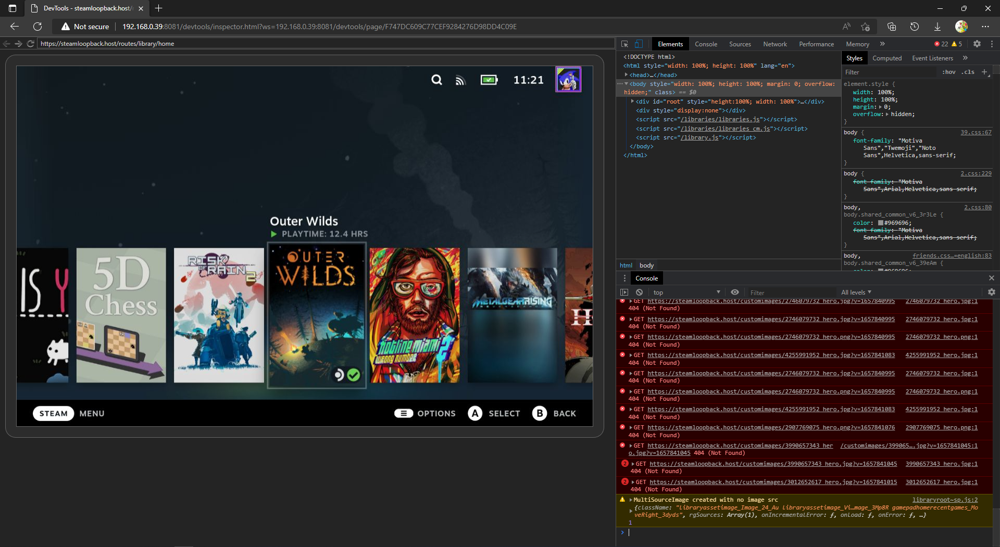
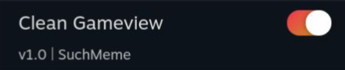
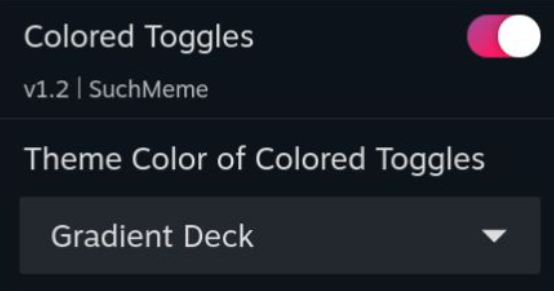
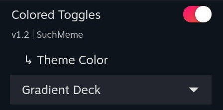
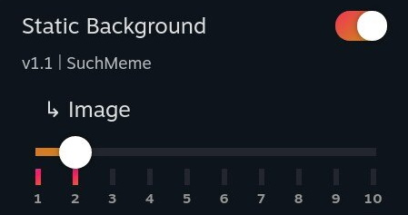
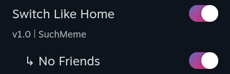
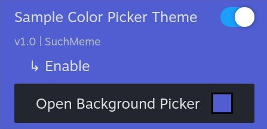
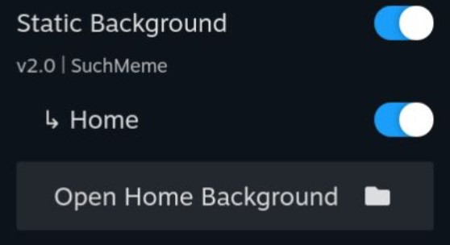

# THIS REPOSTIORY IS DEPRICATED
The new CSS Loader ThemeDB is located at https://deckthemes.com/. Please make any future submissions there

-----


<h1 align="center">
  
  <br>
  CSS Loader - Theme Database
</h1>
<p align="center">
  <a href="https://github.com/suchmememanyskill/CssLoader-ThemeDb/stargazers"></a>
  <a href="https://github.com/suchmememanyskill/CssLoader-ThemeDb/commits/main"></a>
  <a href="https://github.com/suchmememanyskill/CssLoader-ThemeDb/blob/main/LICENSE"></a>
  <a href="https://discord.gg/ZU74G2NJzk"></a>
  <br>
  <br>
  
</p>

## 🎨 Creating a Theme

Development for the CSS Loader is intended to be as simple as possible. That being said, we understand not everyone understands how to edit CSS files. If you have any suggestions for how we can make this guide easier to understand, please feel free to create an issue.

### 📋 Prerequisites

- Some experience in CSS and JSON
- Installed the CSS Loader
- (Optional) Installed a Chromium-based browser

### 📂 Template

There is [a template repository](https://github.com/suchmememanyskill/Steam-Deck-Theme-Template) you can use for creating your first theme. It contains all the files you need to get started and is pre-configured to work with the CSS Loader.

### 🌐 CEF Debugger (Optional)



The Chromium Embedded Framework (CEF) debugger is very useful for creating themes, as it allows you to play around directly with the style of the Steam Deck UI.

The debugger allows you to access tabs that are used for the UI. The main ones are listed below.

- `SP` - The main UI of the Steam Deck
- `QuickAccess` - The Quick Access overlay
- `MainMenu` - The Steam menu overlay

#### 🧰 Recommended Setup

1. Turn on the "Allow Remote CEF Debugging" setting in the Decky settings.
1. Open a Chromium-based browser (ex. Google Chrome, Microsoft Edge, Brave).
1. Go to the inspect page of your browser (ex. chrome://inspect, edge://inspect, brave://inspect).
1. Under "Discover network targets", click "Configure", and enter "{DECK_IP}:8081".
   - You need to be on the same network as your Steam Deck.
   - You can find the IP of your Steam Deck by going into your internet settings, selecting the currently connected network, and looking at the "IP Address" field.
1. Wait a few seconds, and you will see multiple tabs appear under "Remote Target"
   - After selecting a tab, you should be able to see the HTML and CSS used for that specific tab, like the screenshot above.

#### 🧰 Legacy Setup

1. Turn on the "Allow Remote CEF Debugging" setting in the Decky settings.
1. Open a Chromium-based browser (ex. Google Chrome, Microsoft Edge, Brave).
1. Enter "{DECK_IP}:8081" in the browser.
   - You need to be on the same network as your Steam Deck.
   - You can find the IP of your Steam Deck by going into your internet settings, selecting the currently connected network, and looking at the "IP Address" field.
1. Select a tab.
   - After selecting a tab, you should be able to see the HTML and CSS used for that specific tab, like the screenshot above.

### 🖌️ Simple Themes

Themes are folders with CSS files and a single `theme.json` file inside. The `theme.json` determines how everything will be displayed and any options if the theme has them. The CSS Loader loads themes from `/home/deck/homebrew/themes`.



[Here is the example shown above.](https://github.com/suchmememanyskill/Steam-Deck-Theme-Template/tree/main/Sample%20Simple%20Theme)

For a simple theme, the `theme.json` should look something like this.

```json
{
  "name": "Theme Title",
  "author": "GitHubUsername",
  "target": "Library",
  "manifest_version": 4,
  "description": "This is an example description.",
  "version": "v1.0",
  "inject": {
    "shared.css": ["SP"]
  }
}
```

- The name element describes the theme name. This is also used as the folder name for the theme store.
- The author element describes the theme author.
- An optional version field can be added. If no version field is found, the version defaults to `v1.0`.
- The manifest version tells the CSS Loader which version of `themes.json` you are using. The current version is `4`.
- An optional description can be added to show a text description in the theme store.
- The inject tab is a dictionary of relative CSS file paths as keys, and a list of tabs you want the CSS to be injected into.
- The target field describes what part of the UI your theme themes. This is only useful for submitting a theme. The following options are available, but more can be added by creating an issue:
  - System-Wide
  - Background
  - Keyboard
  - Home
  - Background
  - Library
  - Store
  - Friends and Chat
  - Media
  - Downloads
  - Settings
  - Lock Screen
  - Tweak
  - Other

### 🖼️ Complex Themes



[Here is the example shown above.](https://github.com/suchmememanyskill/Steam-Deck-Theme-Template/tree/main/Sample%20Advanced%20Theme)

A complex theme is a theme with patches. Patches are menus that apply additional CSS depending on the selection. The `theme.json` for a complex theme should look something like this.

```json
{
  "name": "Colored Toggles",
  "version": "v1.2",
  "author": "SuchMeme",
  "target": "System-Wide",
  "description": "this is an example description",
  "manifest_version": 2,
  "inject": {
    "shared.css": ["QuickAccess", "SP", "MainMenu"]
  },
  "patches": {
    "Theme Color": {
      "default": "Orange",
      "type": "dropdown",
      "values": {
        "Orange": {},
        "Lime": {
          "colors/lime.css": ["QuickAccess", "SP", "MainMenu"]
        },
        "Red": {
          "colors/red.css": ["QuickAccess", "SP", "MainMenu"]
        },
        "Magenta": {
          "colors/magenta.css": ["QuickAccess", "SP", "MainMenu"]
        },
        "Gradient RGB": {
          "colors/gradient_rgb.css": ["QuickAccess", "SP", "MainMenu"]
        },
        "Gradient Deck": {
          "colors/gradient_deck.css": ["QuickAccess", "SP", "MainMenu"]
        }
      }
    }
  }
}
```

> The patches section is a dictionary of patch names as key. The value is a dictionary where keys are it's options and their value is the applied CSS, similar to the "inject" section. The special key "default" is required to indicate a default option.

Patches allow for choosing between a dropdown, a checkbox (toggle), or a slider for patch selection using the `type` field.

#### 🔽 Dropdown

`"type": "dropdown"`

This is the default value. This type gives a dropdown of all keys in the `values` dictionary. Choosing an option injects only the CSS specified within the selected value.



#### 🎚️ Slider

`"type": "slider"`

This type gives a slider with the labels of the points of all keys in the `values` dictionary. Choosing an option injects only the CSS specified within the selected value.



#### ✅ Checkbox (Toggle)

`"type": "checkbox"`

This type represents the `values` field as a toggle. This type is unique in the sense that it limits what options you can put in the `values` dictionary. You need to have a `Yes` and a `No` option in the `values` dictionary, otherwise, the type falls back to a dropdown. When the toggle is on, `Yes` is selected, otherwise, `No` is selected.



#### 🚫 None

`"type": "none"`

Displays an arrow with the patch name. Has no functional use. For use with components.

### ➕ Additional Features

#### 📁 Local Files

You can access files locally from CSS if you use the correct URL. You can access files like fonts, images, and more by using the following URL. Keep in mind that if you plan to upload your theme to the theme store, you need to configure your [🗃️ File Management](#-file-management) correctly.

`/themes_custom/{your_theme_name}/{image_path}`

[Here is an example.](https://github.com/suchmememanyskill/Steam-Deck-Theme-Template/tree/main/Sample%20Background%20Theme)

#### 📦 Adding Dependencies

Dependencies are useful if you want to bundle another theme or want to make small modifications to an existing theme. All dependencies get enabled alongside your theme.

In the `themes.json` file, specify a field called `"dependencies"`. This is a dictionary in which the keys are the name of the theme you want to be dependencies, with their values being another dictionary. This dictionary's keys are the name of any patch this theme has, and the value is the name of a value in the patch. If you don't want to modify any patch value, write `{}` as the value.

```json
"dependencies": {
    "Switch Like Home": {
        "No Friends": "Yes"
    },
    "Clean Gameview": {}
}
```

> If a theme has a dependencies field like the one above, it will enable both Switch Like Home and Clean Gameview. Switch Like Home's 'No Friends' patch gets forced to 'Yes'.

[Here is an example.](https://github.com/suchmememanyskill/Steam-Deck-Theme-Template/tree/main/Sample%20Dependency%20Theme)

#### 🗃️ Components

Components are a way to attach extra parts to a selectable patch option. Inside a patch, you can make a `"components"` field (its value is a list), and put the components inside.

##### 🎨 Color Picker



[Here is an example.](https://github.com/suchmememanyskill/Steam-Deck-Theme-Template/tree/main/Sample%20Color%20Picker%20Theme)

The color picker component injects a CSS variable with a user-specified color.

```json
"components": [
    {
        "name": "Background Picker",
        "type": "color-picker",
        "on": "_",
        "default": "#000",
        "css_variable": "test-main-color",
        "tabs": ["QuickAccess"]
    }
]
```

- `name` refers to the name of the component shown to the user
- `type` refers to the type of component
- `on` refers to what patch value the component should be displayed on
- `default` refers to what default hex color the color picker should default to
- `css_variable` refers to the name of the CSS variable that will be injected
- `tabs` refers to what tabs the CSS variable will be injected into

##### 📷 Image Picker



[Here is an example.](https://github.com/suchmememanyskill/Steam-Deck-Themes/tree/main/static-background)

The image picker component injects a user-supplied file using a file picker into a CSS variable as `url(path/to/file)`. Only files from `~/homebrew/themes` can be selected.

```json
"components": [
    {
        "name": "Image Picker",
        "type": "image-picker",
        "on": "_",
        "default": "ThemeName/background.jpg",
        "css_variable": "test-main-image",
        "tabs": ["SP"]
    }
]
```

- `name` refers to the name of the component shown to the user
- `type` refers to the type of component
- `on` refers to what patch value the component should be displayed on
- `default` refers to what default file path the image picker should default to (relative to `~/homebrew/themes`)
- `css_variable` refers to the name of the CSS variable that will be injected
- `tabs` refers to what tabs the CSS variable will be injected into

## 📨 Uploading a Theme

A pull request to this repository has a specific template to adhere to. Please make sure your theme adheres to [these requirements](https://github.com/suchmememanyskill/CssLoader-ThemeDb/blob/main/.github/pull_request_template.md).

### 💻 Using GitHub

1. Fork this repository.
1. Clone the forked repository to your PC using your favorite Git tool.
1. Create a preview image and place it in the `images/{AUTHOR}` folder.
   - Preferably upload an image in the .jpg format.
1. Create a JSON file named `{AUTHOR}-{THEME_NAME}.json` in the themes folder with the following content:
   - `repo_url`: Required, points to another GitHub repository with the theme
   - `repo_subpath`: Optional, defaults to '.', indicates the subpath to the folder containing the theme
   - `repo_commit`: Required, the commit in the Git repo you want to release
   - `preview_image_path`: Required. This image is displayed in the browse themes UI of the plugin and must be located in this repository
1. If using local files
1. (Optional) Test your theme submission using `py main.py` in the repository folder.
   - Python and Git CLI need to be installed.
   - If you are missing Python libraries, type `pip install -r requirements.txt`.
   - If the script throws no exception, you are ready to commit.
1. Make a commit with the image and JSON files.
1. (Optional) Repeat steps 3 through 6 for any additional themes you would like to add to your pull request.
1. Create a pull request from your fork to this repository.

Here is an example `{AUTHOR}-{THEME_NAME}.json` file:

```json
{
  "repo_url": "https://github.com/suchmememanyskill/Steam-Deck-Themes",
  "repo_subpath": "Clean Gameview",
  "repo_commit": "d9f160",
  "preview_image_path": "images/SuchMeme/Clean Gameview.jpg"
}
```

### 💬 Using Discord (Experimental)
1. [Join SuchMemeManySkill's development Discord server](https://discord.gg/aH9rsuP).
2. Go to the #css-submission-accept channel.
3. Read through and accept the terms. After accepting the terms, a new channel called #css-submissions-bot will appear. Go into this channel.
4. Type `/css submit`, and fill in all applicable fields.
    - The `theme` field accepts a zip file. This zip file should contain the theme at the root level (theme.json is visible when you open the zip). Also, a `thumbnail.jpg` image file should exist on the root level of the zip, which is used as the preview of the theme.
    - The bot verifies your theme before submission.
    - Updates should be supported, by uploading the same theme with the same discord account you uploaded a theme previously with using the bot.
    - If any issues come up, please mention `@Such Meme, Many Skill#2921` in the #css-submissions-bot channel.

This will make a GitHub pull request so it can be reviewed by the CSS Loader team the same way as other submissions.

### 🗃️ File Management

Sometimes, you want to ignore specific files or remove specific files before they get analyzed by the CI of the theme db. This is for example needed if you want to include images in your theme. You can create a file called 'release.json' in the same folder as your 'theme.json' of your theme. Inside, the file should be structured as follows

```json
{
  "include": [],
  "ignore": ["README.MD", "README.md", "Readme.md", "readme.md"]
}
```

Any paths in the "include" field will be included in the theme. Any paths in the "ignore" field will not be included in the download or file-checking process.

## 🙏 Support

If you need any help creating or submitting a theme, please use [the Steam Deck Homebrew Discord server](https://discord.gg/ZU74G2NJzk). Please use the CSS-Loader support thread in the #support-plugins channel.

### 🔼 Upgrading an Old Theme

If you created a theme and would like to upgrade it to the latest manifest version, please follow this guide. The current highest manifest version is `4`.

#### ⬆️ Upgrading from Version 1

To upgrade a version 1 `theme.json`, all options of a patch need to be put in a `values` dictionary, and a `manifest_version` field should be added to the root of the .json with value `4`. Please see [🖌️ Simple Themes](#-simple-themes) for an example.

#### ⬆️ Upgrading from Newer Versions

No breaking changes have been made. You can simply change the `manifest_version` field in the root of `theme.json` to the value `4`.

## ❤️ Special Thanks

The CSS Loader logo is a modified version of the [paint-roller icon](https://fontawesome.com/icons/paint-roller?s=solid&f=classic) by Font Awesome which is licensed under a [Creative Commons Attribution 4.0 International License](https://creativecommons.org/licenses/by/4.0/).
